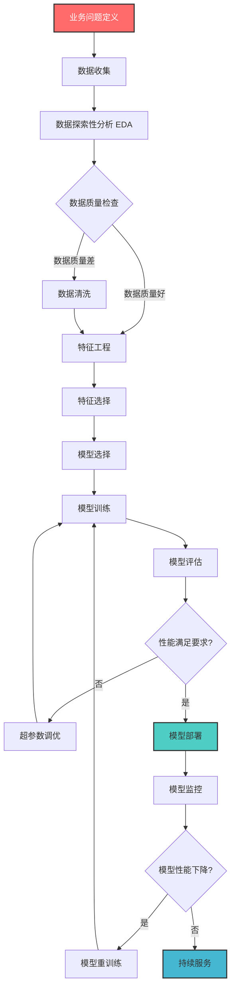
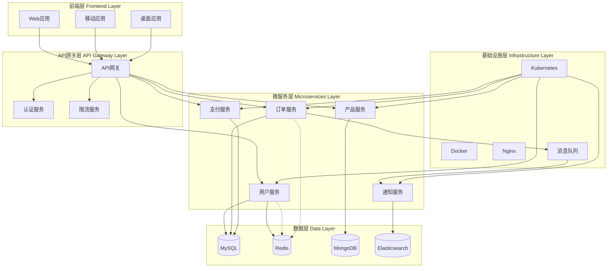
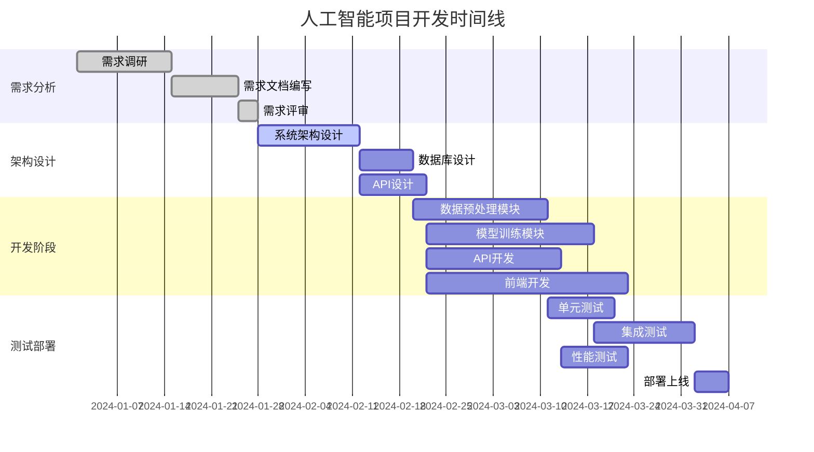
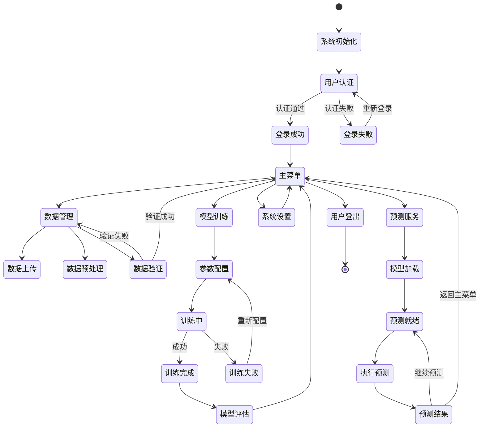
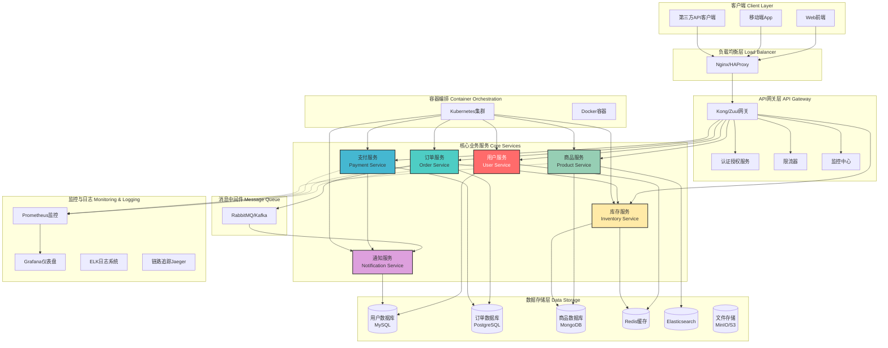
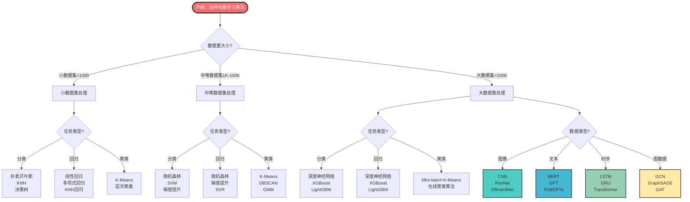
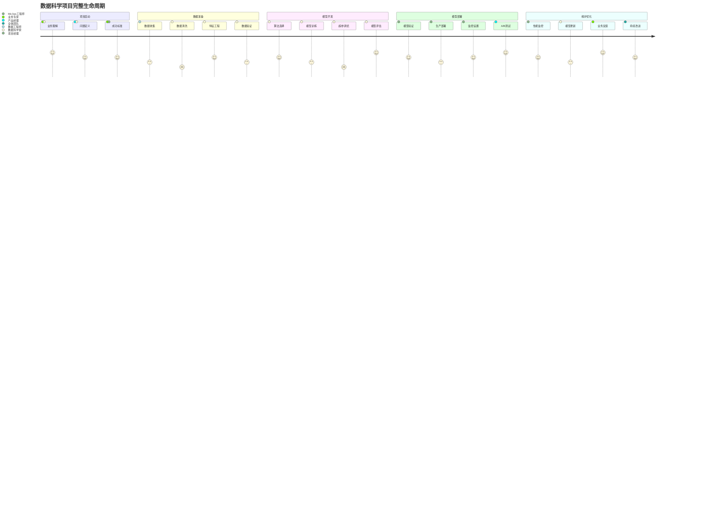
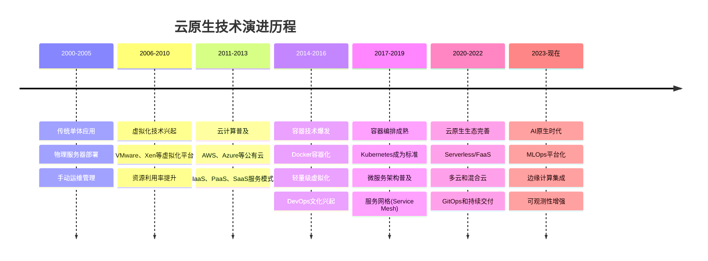

# Markdown语法强大功能展示

## 📊 复杂数学公式展示

### 1. 微积分与数学分析

#### 泰勒级数展开

$$f(x) = \sum_{n=0}^{\infty} \frac{f^{(n)}(a)}{n!}(x-a)^n = f(a) + f'(a)(x-a) + \frac{f''(a)}{2!}(x-a)^2 + \cdots$$

#### 傅里叶变换

$$\mathcal{F}{f(t)} = F(\omega) = \int_{-\infty}^{\infty} f(t) e^{-i\omega t} dt$$

#### 拉普拉斯变换

$$\mathcal{L}{f(t)} = F(s) = \int_{0}^{\infty} f(t) e^{-st} dt$$

### 2. 线性代数

#### 矩阵特征值分解

$$A = P\Lambda P^{-1}$$

其中：

- $A$ 是 $n \times n$ 矩阵
- $\Lambda = \text{diag}(\lambda_1, \lambda_2, \ldots, \lambda_n)$ 是特征值对角矩阵
- $P$ 是特征向量矩阵

#### 奇异值分解 (SVD)

$$A = U\Sigma V^T$$

$$\Sigma = \begin{pmatrix} \sigma_1 & 0 & \cdots & 0 \ 0 & \sigma_2 & \cdots & 0 \ \vdots & \vdots & \ddots & \vdots \ 0 & 0 & \cdots & \sigma_r \end{pmatrix}$$

### 3. 概率论与统计学

#### 贝叶斯定理

$$P(A|B) = \frac{P(B|A) \cdot P(A)}{P(B)} = \frac{P(B|A) \cdot P(A)}{\sum_{i} P(B|A_i) \cdot P(A_i)}$$

#### 正态分布概率密度函数

$$f(x|\mu,\sigma^2) = \frac{1}{\sqrt{2\pi\sigma^2}} \exp\left(-\frac{(x-\mu)^2}{2\sigma^2}\right)$$

#### 最大似然估计

$$\hat{\theta}_{MLE} = \arg\max_{\theta} \mathcal{L}(\theta) = \arg\max_{\theta} \prod_{i=1}^{n} f(x_i|\theta)$$

### 4. 机器学习与深度学习

#### 反向传播算法

$$\frac{\partial E}{\partial w_{ij}} = \frac{\partial E}{\partial o_j} \cdot \frac{\partial o_j}{\partial net_j} \cdot \frac{\partial net_j}{\partial w_{ij}}$$

其中：

- $E$ 是损失函数
- $o_j$ 是神经元 $j$ 的输出
- $net_j = \sum_i w_{ij} x_i$ 是加权输入

#### Softmax函数

$$\text{softmax}(x_i) = \frac{e^{x_i}}{\sum_{j=1}^{K} e^{x_j}}$$

#### 交叉熵损失函数

$$H(p,q) = -\sum_{i=1}^{N} p_i \log(q_i)$$

### 5. 物理学公式

#### 薛定谔方程

$$i\hbar\frac{\partial}{\partial t}\Psi(\mathbf{r},t) = \hat{H}\Psi(\mathbf{r},t)$$

#### 爱因斯坦场方程

$$G_{\mu\nu} + \Lambda g_{\mu\nu} = \frac{8\pi G}{c^4} T_{\mu\nu}$$

#### 麦克斯韦方程组

$$\begin{align} \nabla \cdot \mathbf{E} &= \frac{\rho}{\varepsilon_0} \ \nabla \cdot \mathbf{B} &= 0 \ \nabla \times \mathbf{E} &= -\frac{\partial \mathbf{B}}{\partial t} \ \nabla \times \mathbf{B} &= \mu_0\mathbf{J} + \mu_0\varepsilon_0\frac{\partial \mathbf{E}}{\partial t} \end{align}$$

---

## 🧠 复杂知识图谱

### 人工智能领域知识体系

```mermaid
graph TB
    AI[人工智能 Artificial Intelligence] --> ML[机器学习 Machine Learning]
    AI --> KR[知识表示 Knowledge Representation]
    AI --> NLP[自然语言处理 Natural Language Processing]
    AI --> CV[计算机视觉 Computer Vision]
    AI --> ROBOT[机器人学 Robotics]
    
    ML --> SL[监督学习 Supervised Learning]
    ML --> UL[无监督学习 Unsupervised Learning]
    ML --> RL[强化学习 Reinforcement Learning]
    ML --> DL[深度学习 Deep Learning]
    
    SL --> LR[线性回归 Linear Regression]
    SL --> LOG[逻辑回归 Logistic Regression]
    SL --> SVM[支持向量机 SVM]
    SL --> DT[决策树 Decision Tree]
    SL --> RF[随机森林 Random Forest]
    SL --> GB[梯度提升 Gradient Boosting]
    
    UL --> CLUSTER[聚类 Clustering]
    UL --> PCA[主成分分析 PCA]
    UL --> ICA[独立成分分析 ICA]
    
    CLUSTER --> KM[K-均值 K-Means]
    CLUSTER --> HC[层次聚类 Hierarchical Clustering]
    CLUSTER --> DBSCAN[DBSCAN]
    
    DL --> ANN[人工神经网络 ANN]
    DL --> CNN[卷积神经网络 CNN]
    DL --> RNN[循环神经网络 RNN]
    DL --> TRANS[Transformer]
    DL --> GAN[生成对抗网络 GAN]
    DL --> VAE[变分自编码器 VAE]
    
    RNN --> LSTM[长短期记忆网络 LSTM]
    RNN --> GRU[门控循环单元 GRU]
    
    TRANS --> BERT[BERT]
    TRANS --> GPT[GPT系列]
    TRANS --> T5[T5]
    
    NLP --> TOK[分词 Tokenization]
    NLP --> POS[词性标注 POS Tagging]
    NLP --> NER[命名实体识别 NER]
    NLP --> SENT[情感分析 Sentiment Analysis]
    NLP --> MT[机器翻译 Machine Translation]
    NLP --> QA[问答系统 Question Answering]
    
    CV --> IC[图像分类 Image Classification]
    CV --> OD[目标检测 Object Detection]
    CV --> IS[图像分割 Image Segmentation]
    CV --> FR[人脸识别 Face Recognition]
    CV --> OCR[光学字符识别 OCR]
    
    RL --> MDP[马尔可夫决策过程 MDP]
    RL --> QL[Q学习 Q-Learning]
    RL --> PG[策略梯度 Policy Gradient]
    RL --> AC[Actor-Critic]
    RL --> DQN[深度Q网络 DQN]
    RL --> PPO[近端策略优化 PPO]
    
    style AI fill:#ff6b6b,stroke:#333,stroke-width:3px,color:#fff
    style ML fill:#4ecdc4,stroke:#333,stroke-width:2px
    style DL fill:#45b7d1,stroke:#333,stroke-width:2px
    style NLP fill:#96ceb4,stroke:#333,stroke-width:2px
    style CV fill:#ffeaa7,stroke:#333,stroke-width:2px
    style RL fill:#dda0dd,stroke:#333,stroke-width:2px
```



### 数据科学工作流程



### 软件系统架构图



---

## 📋 复杂表格展示

### 机器学习算法对比表

|算法类型|算法名称|时间复杂度|空间复杂度|优点|缺点|适用场景|
|---|---|---|---|---|---|---|
|**线性模型**|线性回归|O(n×p²)|O(p)|简单快速、可解释性强|假设线性关系|连续值预测|
||逻辑回归|O(n×p×iter)|O(p)|概率输出、无需调参|线性决策边界|二分类问题|
|**树模型**|决策树|O(n×log n×p)|O(n)|可解释、处理非线性|容易过拟合|特征重要性分析|
||随机森林|O(n×log n×p×k)|O(n×k)|减少过拟合、特征重要性|内存消耗大|中等规模数据|
||XGBoost|O(n×log n×p×iter)|O(n)|性能优异、并行训练|参数多、调参复杂|结构化数据竞赛|
|**实例学习**|KNN|O(1) / O(n×p)|O(n×p)|简单、非参数|计算量大、维度敏感|小数据集分类|
|**聚类**|K-Means|O(n×k×iter×p)|O(n×p)|快速、简单|需要预设k值|球形聚类|
||DBSCAN|O(n×log n)|O(n)|自动确定簇数、处理噪声|参数敏感|密度聚类|
|**深度学习**|CNN|O(n×h×w×c×f)|O(batch×h×w×c)|图像处理强、特征自动提取|数据需求大、黑盒|图像识别|
||RNN/LSTM|O(seq×batch×h²)|O(batch×h)|序列建模、记忆能力|梯度问题、计算慢|时序数据|
||Transformer|O(seq²×d)|O(seq×d)|并行计算、长依赖|内存需求大|NLP任务|

### 编程语言特性对比

|语言|类型系统|编译方式|内存管理|并发模型|主要用途|性能|学习难度|
|---|---|---|---|---|---|---|---|
|**Python**|动态强类型|解释执行|垃圾回收|GIL限制|数据科学、Web开发|⭐⭐|⭐|
|**Java**|静态强类型|编译到字节码|垃圾回收|多线程|企业应用、Android|⭐⭐⭐|⭐⭐|
|**C++**|静态强类型|编译到机器码|手动管理|多线程|系统编程、游戏|⭐⭐⭐⭐⭐|⭐⭐⭐⭐⭐|
|**JavaScript**|动态弱类型|JIT编译|垃圾回收|事件循环|Web前端、Node.js|⭐⭐⭐|⭐⭐|
|**Go**|静态强类型|编译到机器码|垃圾回收|Goroutine|云服务、微服务|⭐⭐⭐⭐|⭐⭐|
|**Rust**|静态强类型|编译到机器码|所有权系统|无畏并发|系统编程、区块链|⭐⭐⭐⭐⭐|⭐⭐⭐⭐|

---

## 🎯 代码展示

### Python机器学习代码示例

```python
import numpy as np
import pandas as pd
from sklearn.model_selection import train_test_split, cross_val_score
from sklearn.ensemble import RandomForestClassifier
from sklearn.metrics import classification_report, confusion_matrix
import matplotlib.pyplot as plt
import seaborn as sns

class MLPipeline:
    """机器学习流水线类"""
    
    def __init__(self, model=None, random_state=42):
        self.model = model or RandomForestClassifier(random_state=random_state)
        self.random_state = random_state
        self.is_fitted = False
        
    def preprocess_data(self, X, y=None):
        """数据预处理"""
        # 处理缺失值
        X_clean = X.fillna(X.mean())
        
        # 特征缩放
        from sklearn.preprocessing import StandardScaler
        scaler = StandardScaler()
        X_scaled = scaler.fit_transform(X_clean)
        
        return X_scaled, scaler
    
    def train(self, X, y, test_size=0.2):
        """训练模型"""
        # 数据预处理
        X_processed, self.scaler = self.preprocess_data(X)
        
        # 分割数据
        X_train, X_test, y_train, y_test = train_test_split(
            X_processed, y, test_size=test_size, 
            random_state=self.random_state, stratify=y
        )
        
        # 训练模型
        self.model.fit(X_train, y_train)
        self.is_fitted = True
        
        # 交叉验证
        cv_scores = cross_val_score(self.model, X_train, y_train, cv=5)
        
        # 测试集评估
        y_pred = self.model.predict(X_test)
        
        results = {
            'cv_scores': cv_scores,
            'cv_mean': cv_scores.mean(),
            'cv_std': cv_scores.std(),
            'test_score': self.model.score(X_test, y_test),
            'classification_report': classification_report(y_test, y_pred),
            'confusion_matrix': confusion_matrix(y_test, y_pred)
        }
        
        return results
    
    def predict(self, X):
        """预测"""
        if not self.is_fitted:
            raise ValueError("模型尚未训练，请先调用train方法")
        
        X_processed = self.scaler.transform(X.fillna(X.mean()))
        return self.model.predict(X_processed)
    
    def feature_importance(self, feature_names):
        """特征重要性分析"""
        if hasattr(self.model, 'feature_importances_'):
            importance_df = pd.DataFrame({
                'feature': feature_names,
                'importance': self.model.feature_importances_
            }).sort_values('importance', ascending=False)
            
            return importance_df
        else:
            return None

# 使用示例
if __name__ == "__main__":
    # 创建示例数据
    from sklearn.datasets import make_classification
    
    X, y = make_classification(
        n_samples=1000, n_features=20, n_informative=10,
        n_redundant=10, n_clusters_per_class=1, random_state=42
    )
    
    feature_names = [f'feature_{i}' for i in range(X.shape[1])]
    X_df = pd.DataFrame(X, columns=feature_names)
    
    # 创建并训练模型
    pipeline = MLPipeline()
    results = pipeline.train(X_df, y)
    
    print(f"交叉验证平均分数: {results['cv_mean']:.4f} (+/- {results['cv_std']*2:.4f})")
    print(f"测试集分数: {results['test_score']:.4f}")
    print("\n分类报告:")
    print(results['classification_report'])
```

### SQL复杂查询示例

```sql
-- 复杂的电商数据分析查询
WITH monthly_sales AS (
    SELECT 
        DATE_TRUNC('month', order_date) as month,
        product_category,
        SUM(quantity * unit_price) as total_sales,
        COUNT(DISTINCT order_id) as order_count,
        COUNT(DISTINCT customer_id) as unique_customers,
        AVG(quantity * unit_price) as avg_order_value
    FROM orders o
    JOIN order_items oi ON o.order_id = oi.order_id
    JOIN products p ON oi.product_id = p.product_id
    WHERE order_date >= DATE_TRUNC('year', CURRENT_DATE)
    GROUP BY DATE_TRUNC('month', order_date), product_category
),
category_rankings AS (
    SELECT 
        month,
        product_category,
        total_sales,
        order_count,
        unique_customers,
        avg_order_value,
        ROW_NUMBER() OVER (PARTITION BY month ORDER BY total_sales DESC) as sales_rank,
        LAG(total_sales) OVER (PARTITION BY product_category ORDER BY month) as prev_month_sales,
        ROUND(
            (total_sales - LAG(total_sales) OVER (PARTITION BY product_category ORDER BY month)) 
            / NULLIF(LAG(total_sales) OVER (PARTITION BY product_category ORDER BY month), 0) * 100, 
            2
        ) as growth_rate
    FROM monthly_sales
),
customer_segments AS (
    SELECT 
        customer_id,
        SUM(quantity * unit_price) as total_spent,
        COUNT(DISTINCT order_id) as order_frequency,
        MAX(order_date) as last_order_date,
        CASE 
            WHEN SUM(quantity * unit_price) > 10000 THEN 'VIP'
            WHEN SUM(quantity * unit_price) > 5000 THEN 'Premium'
            WHEN SUM(quantity * unit_price) > 1000 THEN 'Regular'
            ELSE 'New'
        END as customer_segment
    FROM orders o
    JOIN order_items oi ON o.order_id = oi.order_id
    GROUP BY customer_id
)
SELECT 
    cr.month,
    cr.product_category,
    cr.total_sales,
    cr.sales_rank,
    cr.growth_rate,
    cr.unique_customers,
    cr.avg_order_value,
    cs_stats.vip_customers,
    cs_stats.premium_customers,
    cs_stats.regular_customers,
    ROUND(cr.total_sales / SUM(cr.total_sales) OVER (PARTITION by cr.month) * 100, 2) as market_share
FROM category_rankings cr
LEFT JOIN (
    SELECT 
        DATE_TRUNC('month', o.order_date) as month,
        p.product_category,
        COUNT(DISTINCT CASE WHEN cs.customer_segment = 'VIP' THEN cs.customer_id END) as vip_customers,
        COUNT(DISTINCT CASE WHEN cs.customer_segment = 'Premium' THEN cs.customer_id END) as premium_customers,
        COUNT(DISTINCT CASE WHEN cs.customer_segment = 'Regular' THEN cs.customer_id END) as regular_customers
    FROM customer_segments cs
    JOIN orders o ON cs.customer_id = o.customer_id
    JOIN order_items oi ON o.order_id = oi.order_id
    JOIN products p ON oi.product_id = p.product_id
    GROUP BY DATE_TRUNC('month', o.order_date), p.product_category
) cs_stats ON cr.month = cs_stats.month AND cr.product_category = cs_stats.product_category
ORDER BY cr.month DESC, cr.sales_rank;
```

---

## 📈 图表和流程图

### 算法复杂度对比

|排序算法|最好情况|平均情况|最坏情况|空间复杂度|稳定性|
|---|---|---|---|---|---|
|冒泡排序|O(n)|O(n²)|O(n²)|O(1)|稳定|
|选择排序|O(n²)|O(n²)|O(n²)|O(1)|不稳定|
|插入排序|O(n)|O(n²)|O(n²)|O(1)|稳定|
|快速排序|O(n log n)|O(n log n)|O(n²)|O(log n)|不稳定|
|归并排序|O(n log n)|O(n log n)|O(n log n)|O(n)|稳定|
|堆排序|O(n log n)|O(n log n)|O(n log n)|O(1)|不稳定|
|计数排序|O(n+k)|O(n+k)|O(n+k)|O(k)|稳定|

```mermaid
graph TD
    subgraph complexity["算法复杂度分类"]
        O1[O'(1)' 常数时间]
        On[O'(n)' 线性时间]
        OnlogN[O'(n log n)' 对数线性时间]
        On2[O'(n²)' 平方时间]
        On3[O'(n³)' 立方时间]
        O2n[O'(2ⁿ)' 指数时间]
    end
    
    subgraph examples["典型算法示例"]
        O1 --> hash["哈希表查找"]
        On --> linear["线性搜索"]
        OnlogN --> merge["归并排序"]
        OnlogN --> quick["快速排序平均"]
        On2 --> bubble["冒泡排序"]
        On2 --> selection["选择排序"]
        On3 --> matrix["矩阵乘法"]
        O2n --> subset["子集枚举"]
    end
    
    style O1 fill:#96ceb4,stroke:#333,stroke-width:2px
    style On fill:#4ecdc4,stroke:#333,stroke-width:2px
    style OnlogN fill:#45b7d1,stroke:#333,stroke-width:2px
    style On2 fill:#ffeaa7,stroke:#333,stroke-width:2px
    style On3 fill:#fd79a8,stroke:#333,stroke-width:2px
    style O2n fill:#ff6b6b,stroke:#333,stroke-width:2px,color:#fff
```

### 项目管理甘特图



### 系统状态图



---

## 🏗️ 架构图和组织结构

### 微服务架构图



### 组织架构图

```mermaid
graph TD
    CEO[首席执行官 CEO] --> CTO[首席技术官 CTO]
    CEO --> CPO[首席产品官 CPO]
    CEO --> CFO[首席财务官 CFO]
    CEO --> CHRO[首席人力官 CHRO]
    
    CTO --> ENG_DIR[工程总监]
    CTO --> DATA_DIR[数据总监]
    CTO --> INFRA_DIR[基础设施总监]
    CTO --> QA_DIR[质量保证总监]
    
    ENG_DIR --> FE_TEAM[前端团队]
    ENG_DIR --> BE_TEAM[后端团队]
    ENG_DIR --> MOBILE_TEAM[移动端团队]
    ENG_DIR --> AI_TEAM[AI算法团队]
    
    DATA_DIR --> DE_TEAM[数据工程团队]
    DATA_DIR --> DS_TEAM[数据科学团队]
    DATA_DIR --> ML_TEAM[机器学习团队]
    
    INFRA_DIR --> DEVOPS_TEAM[DevOps团队]
    INFRA_DIR --> SEC_TEAM[安全团队]
    INFRA_DIR --> DBA_TEAM[数据库团队]
    
    QA_DIR --> TEST_TEAM[测试团队]
    QA_DIR --> AUTO_TEAM[自动化团队]
    
    CPO --> PM_TEAM[产品经理团队]
    CPO --> UX_TEAM[用户体验团队]
    CPO --> BA_TEAM[业务分析团队]
    
    CFO --> FIN_TEAM[财务团队]
    CFO --> LEGAL_TEAM[法务团队]
    
    CHRO --> HR_TEAM[人力资源团队]
    CHRO --> TALENT_TEAM[人才招聘团队]
    
    style CEO fill:#ff6b6b,stroke:#333,stroke-width:3px,color:#fff
    style CTO fill:#4ecdc4,stroke:#333,stroke-width:2px
    style CPO fill:#45b7d1,stroke:#333,stroke-width:2px
    style CFO fill:#96ceb4,stroke:#333,stroke-width:2px
    style CHRO fill:#ffeaa7,stroke:#333,stroke-width:2px
```



---

## 💡 高级Markdown特性展示

### 任务清单和进度追踪

#### 🚀 项目开发任务清单

- [x] **需求分析阶段**
    - [x] 用户调研和访谈
    - [x] 竞品分析报告
    - [x] 功能需求文档 (PRD)
    - [x] 技术需求文档 (TRD)
- [x] **设计阶段**
    - [x] UI/UX设计稿
    - [x] 系统架构设计
    - [x] 数据库设计
    - [x] API接口设计
- [ ] **开发阶段**
    - [x] 环境搭建
    - [x] 后端核心模块开发
    - [ ] 前端界面开发 (进行中 🔄)
    - [ ] 移动端开发
    - [ ] 第三方集成
- [ ] **测试阶段**
    - [ ] 单元测试
    - [ ] 集成测试
    - [ ] 性能测试
    - [ ] 安全测试
- [ ] **部署和发布**
    - [ ] 生产环境部署
    - [ ] 监控系统配置
    - [ ] 文档整理
    - [ ] 用户培训

### 告警和提示框

> **⚠️ 重要提示**
> 
> 在生产环境中部署机器学习模型时，需要特别注意以下几点：
> 
> - 模型版本管理和回滚策略
> - 数据漂移检测和模型重训练
> - 性能监控和资源使用优化
> - 安全性和隐私保护措施

> **💡 最佳实践**
> 
> 使用微服务架构时的关键考虑因素：
> 
> 1. **服务拆分粒度**：按业务边界而非技术边界拆分
> 2. **数据一致性**：使用分布式事务或最终一致性
> 3. **服务发现**：使用服务注册中心如Consul或Eureka
> 4. **容错设计**：实现熔断器、重试和降级机制

> **🔥 性能优化技巧**
> 
> **数据库优化：**
> 
> - 合理使用索引，避免过度索引
> - 分库分表处理大数据量
> - 读写分离和主从复制
> - 使用连接池管理数据库连接
> 
> **缓存策略：**
> 
> - 多级缓存：浏览器缓存 → CDN → Redis → 本地缓存
> - 缓存失效策略：TTL、LRU、写入失效
> - 缓存预热和缓存雪崩防护

### 脚注和引用

在机器学习领域，深度学习[^1]已经成为解决复杂问题的主要方法。卷积神经网络[^2]在计算机视觉任务中表现出色，而Transformer架构[^3]则在自然语言处理领域取得了突破性进展。

近年来，大语言模型[^4]如GPT系列和BERT系列模型在各种NLP任务上都达到了人类水平的性能。这些模型的成功很大程度上依赖于注意力机制[^5]的创新。

[^1]: Deep Learning是机器学习的一个分支，使用多层神经网络来学习数据的复杂模式和表示。

[^2]: Convolutional Neural Network (CNN)是一种专门用于处理具有网格结构数据（如图像）的深度神经网络。

[^3]: Transformer是一种基于注意力机制的神经网络架构，由Vaswani等人在2017年的论文"Attention Is All You Need"中首次提出。

[^4]: Large Language Model (LLM)是指参数量巨大的语言模型，通常具有数十亿到数千亿个参数。

[^5]: Attention Mechanism允许模型在处理序列数据时动态地关注输入的不同部分，极大地提高了模型的表达能力。

### 数学公式详细展示

#### 高级统计学公式

**多元正态分布：** $f(\mathbf{x}) = \frac{1}{(2\pi)^{k/2}|\Sigma|^{1/2}} \exp\left(-\frac{1}{2}(\mathbf{x}-\boldsymbol{\mu})^T\Sigma^{-1}(\mathbf{x}-\boldsymbol{\mu})\right)$

其中：

- $\mathbf{x} \in \mathbb{R}^k$ 是随机向量
- $\boldsymbol{\mu} \in \mathbb{R}^k$ 是均值向量
- $\Sigma \in \mathbb{R}^{k \times k}$ 是协方差矩阵
- $|\Sigma|$ 是协方差矩阵的行列式

**信息论中的交叉熵：** $H(P,Q) = -\sum_{x \in \mathcal{X}} P(x) \log Q(x) = -E_P[\log Q]$

**KL散度（相对熵）：** $D_{KL}(P||Q) = \sum_{x \in \mathcal{X}} P(x) \log \frac{P(x)}{Q(x)} = E_P\left[\log \frac{P}{Q}\right]$

#### 深度学习核心公式

**Batch Normalization：** $\hat{x}_i = \frac{x_i - \mu_B}{\sqrt{\sigma_B^2 + \epsilon}}$ $y_i = \gamma \hat{x}_i + \beta$

其中：

- $\mu_B = \frac{1}{m}\sum_{i=1}^{m} x_i$ 是批次均值
- $\sigma_B^2 = \frac{1}{m}\sum_{i=1}^{m} (x_i - \mu_B)^2$ 是批次方差
- $\gamma, \beta$ 是可学习参数

**Multi-Head Attention：** $\text{MultiHead}(Q,K,V) = \text{Concat}(\text{head}_1, \ldots, \text{head}_h)W^O$

其中： $\text{head}_i = \text{Attention}(QW_i^Q, KW_i^K, VW_i^V)$

$\text{Attention}(Q,K,V) = \text{softmax}\left(\frac{QK^T}{\sqrt{d_k}}\right)V$

**Adam优化器更新规则：** $m_t = \beta_1 m_{t-1} + (1-\beta_1) g_t$ $v_t = \beta_2 v_{t-1} + (1-\beta_2) g_t^2$ $\hat{m}_t = \frac{m_t}{1-\beta_1^t}$ $\hat{v}_t = \frac{v_t}{1-\beta_2^t}$ $\theta_{t+1} = \theta_t - \frac{\alpha}{\sqrt{\hat{v}_t} + \epsilon} \hat{m}_t$

---

## 📊 高级数据可视化概念图

### 机器学习模型选择决策树



### 数据科学项目生命周期



### 云原生架构演进图



---

## 🎨 创意展示区域

### ASCII艺术图

```
    🚀 AI/ML 技术栈全景图
    
    ┌─────────────────────────────────────────────────────────────┐
    │                        应用层 Application Layer              │
    │  🎯 推荐系统  🔍 搜索引擎  🤖 聊天机器人  📊 智能分析       │
    └─────────────────────────────────────────────────────────────┘
                                    │
    ┌─────────────────────────────────────────────────────────────┐
    │                      算法层 Algorithm Layer                 │
    │  🧠 深度学习  📈 机器学习  📊 统计分析  🔬 强化学习        │
    └─────────────────────────────────────────────────────────────┘
                                    │
    ┌─────────────────────────────────────────────────────────────┐
    │                      框架层 Framework Layer                 │
    │  🐍 TensorFlow  ⚡ PyTorch  📚 Scikit-learn  🔥 Keras      │
    └─────────────────────────────────────────────────────────────┘
                                    │
    ┌─────────────────────────────────────────────────────────────┐
    │                      计算层 Computing Layer                 │
    │  💻 CPU集群  🎮 GPU加速  ☁️ 云计算  📱 边缘计算            │
    └─────────────────────────────────────────────────────────────┘
                                    │
    ┌─────────────────────────────────────────────────────────────┐
    │                      数据层 Data Layer                      │
    │  🗄️ 数据湖  📊 数据仓库  🔄 数据流  📁 特征存储            │
    └─────────────────────────────────────────────────────────────┘
```

### 技术能力雷达图概念

```
            性能优化 ⭐⭐⭐⭐⭐
                    /|\
                   / | \
                  /  |  \
        系统设计 ⭐⭐⭐⭐ | ⭐⭐⭐⭐⭐ 算法能力
              /    |    \
             /     |     \
            /      |      \
    数据处理 ⭐⭐⭐    |    ⭐⭐⭐ 工程实践
            \      |      /
             \     |     /
              \    |    /
        团队协作 ⭐⭐⭐⭐ | ⭐⭐⭐ 业务理解
                  \  |  /
                   \ | /
                    \|/
            持续学习 ⭐⭐⭐⭐⭐
```

---

## 📝 总结

这个Markdown文档展示了Markdown语法的强大功能，包括：

### ✨ 核心特性

1. **复杂数学公式**：使用LaTeX语法支持各种数学表达式
2. **Mermaid图表**：流程图、架构图、甘特图、时序图等
3. **表格功能**：支持复杂的数据表格展示
4. **代码高亮**：多语言代码语法高亮支持
5. **任务列表**：支持嵌套的待办事项管理
6. **引用和脚注**：学术和技术文档的必备功能

### 🎯 适用场景

- **技术文档**：API文档、架构设计文档
- **项目管理**：需求文档、设计文档、进度追踪
- **学术写作**：研究报告、论文草稿
- **教育培训**：课程材料、学习笔记
- **团队协作**：知识分享、标准化文档

### 💡 最佳实践建议

1. **结构化组织**：使用标题层级组织内容
2. **视觉化展示**：适当使用图表和表格
3. **代码规范**：保持代码块的整洁和注释
4. **链接管理**：合理使用内部链接和脚注
5. **版本控制**：结合Git进行文档版本管理

Markdown的强大之处在于它简洁的语法能够创建出专业级的文档，同时保持良好的可读性和可维护性。无论是技术团队的协作文档，还是个人的学习笔记，Markdown都是一个优秀的选择。

---

_📅 最后更新时间：2024年7月_  
_👨‍💻 作者：AI助手_  
_📧 联系方式：[email@example.com](mailto:email@example.com)_